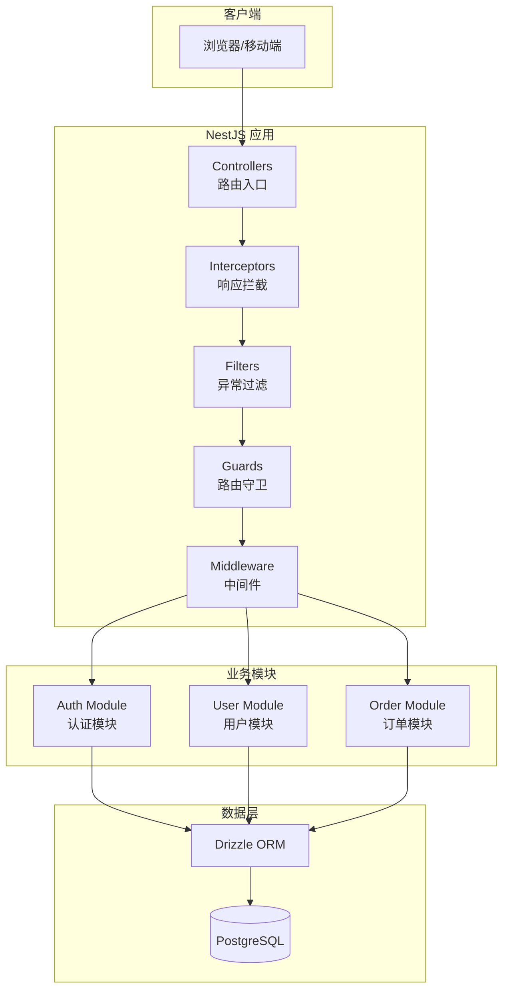
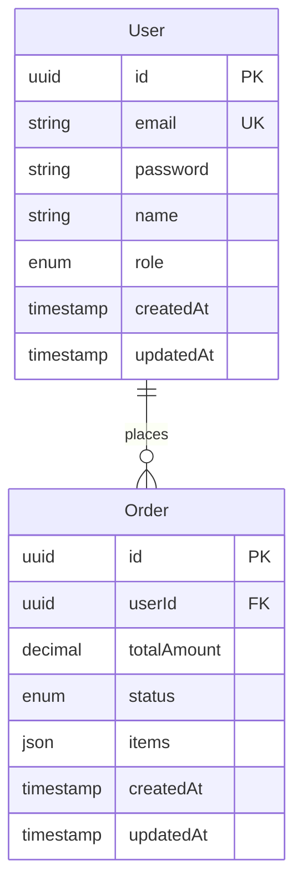
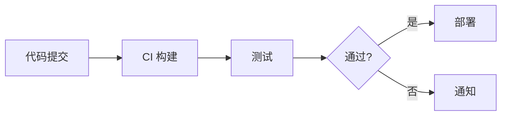

# 系统架构文档

## 文档信息
- **功能名称**：NestJS 服务框架
- **版本**：1.0
- **创建日期**：2026-03-17
- **作者**：Architect Agent

## 摘要

> 下游 Agent 请优先阅读本节，需要细节时再查阅完整文档。

- **架构模式**：单体应用 (Monolithic)
- **技术栈**：Node.js / TypeScript / NestJS / PostgreSQL / Drizzle ORM
- **核心设计决策**：
  1. 使用 NestJS 框架，遵循官方目录结构和模块化设计
  2. 集成 Drizzle ORM 作为数据库访问层，支持 schema 同步
  3. 使用 Interceptor 统一成功响应格式，Filter 统一异常处理
- **主要风险**：无重大技术风险
- **项目结构**：参考 NestJS 官方目录结构

---

## 1. 架构概述

### 1.1 系统架构图



### 1.2 架构决策

| 决策 | 选项 | 选择 | 原因 |
|------|------|------|------|
| 后端框架 | Express/Fastify | NestJS | 依赖注入、模块化、装饰器语法 |
| ORM | TypeORM/Prisma/Drizzle | Drizzle | 轻量级、类型安全、SQL-like 语法 |
| 数据库 | MySQL/MongoDB/PostgreSQL | PostgreSQL | 关系型数据、JSON 支持、稳定性 |
| API 风格 | GraphQL/REST | RESTful | 简单直观、社区成熟 |
| 文档工具 | Postman/Swagger | Swagger/NestJS Swagger | 官方集成、自动生成 |

---

## 2. 技术栈

| 层级 | 技术 | 版本 | 说明 |
|------|------|------|------|
| 运行时 | Node.js | >= 18 | JavaScript 运行环境 |
| 语言 | TypeScript | ^5.0 | 类型安全的 JavaScript |
| 后端框架 | NestJS | ^10.0 | Node.js 企业级框架 |
| ORM | Drizzle ORM | ^0.29 | 轻量级 TypeScript ORM |
| 数据库 | PostgreSQL | >= 14 | 关系型数据库 |
| API 文档 | @nestjs/swagger | ^7.0 | Swagger/OpenAPI 集成 |
| 配置管理 | dotenv | ^16.0 | 环境变量管理 |

---

## 3. 目录结构

```
nestjs-server-template/
├── src/
│   ├── main.ts                      # 应用入口
│   ├── app.module.ts                # 根模块
│   ├── config/
│   │   └── configuration.ts         # 配置文件
│   ├── common/
│   │   ├── interceptors/           # 拦截器
│   │   │   ├── success.interceptor.ts
│   │   │   └── transform.interceptor.ts
│   │   ├── filters/                 # 过滤器
│   │   │   └── http-exception.filter.ts
│   │   ├── decorators/              # 装饰器
│   │   │   └── current-user.decorator.ts
│   │   ├── guards/                  # 守卫
│   │   │   └── auth.guard.ts
│   │   └── pipes/                   # 管道
│   │       └── validation.pipe.ts
│   ├── database/
│   │   ├── database.module.ts      # 数据库模块
│   │   └── migrations/              # 迁移文件
│   │       └── .gitkeep
│   ├── modules/
│   │   ├── auth/
│   │   │   ├── auth.module.ts
│   │   │   ├── auth.controller.ts
│   │   │   ├── auth.service.ts
│   │   │   ├── dto/
│   │   │   │   ├── login.dto.ts
│   │   │   │   └── register.dto.ts
│   │   │   └── entities/
│   │   │       └── user.entity.ts
│   │   ├── user/
│   │   │   ├── user.module.ts
│   │   │   ├── user.controller.ts
│   │   │   ├── user.service.ts
│   │   │   ├── dto/
│   │   │   │   ├── create-user.dto.ts
│   │   │   │   └── update-user.dto.ts
│   │   │   └── entities/
│   │   │       └── user.entity.ts
│   │   └── order/
│   │       ├── order.module.ts
│   │       ├── order.controller.ts
│   │       ├── order.service.ts
│   │       ├── dto/
│   │       │   ├── create-order.dto.ts
│   │       │   └── update-order.dto.ts
│   │       └── entities/
│   │           └── order.entity.ts
│   └── utils/
│       └── hash.util.ts             # 工具函数
├── test/                            # 测试文件
│   └── app.e2e-spec.ts
├── .env                             # 环境配置
├── .env.example                     # 环境配置示例
├── .gitignore
├── package.json
├── tsconfig.json
├── nest-cli.json
├── drizzle.config.ts                # Drizzle 配置
└── README.md
```

---

## 4. 数据模型

### 4.1 实体关系图



### 4.2 数据字典

#### 表：users
| 字段 | 类型 | 必填 | 默认值 | 说明 |
|------|------|------|--------|------|
| id | UUID | 是 | auto | 主键，用户ID |
| email | VARCHAR(255) | 是 | - | 邮箱，唯一 |
| password | VARCHAR(255) | 是 | - | 密码（加密存储） |
| name | VARCHAR(100) | 否 | - | 用户名 |
| role | ENUM('user', 'admin') | 是 | 'user' | 角色 |
| createdAt | TIMESTAMP | 是 | now() | 创建时间 |
| updatedAt | TIMESTAMP | 是 | now() | 更新时间 |

#### 表：orders
| 字段 | 类型 | 必填 | 默认值 | 说明 |
|------|------|------|--------|------|
| id | UUID | 是 | auto | 主键，订单ID |
| user_id | UUID | 是 | - | 外键，关联用户 |
| total_amount | DECIMAL(10,2) | 是 | - | 订单总金额 |
| status | ENUM('pending','paid','shipped','completed','cancelled') | 是 | 'pending' | 订单状态 |
| items | JSONB | 是 | [] | 订单明细 |
| created_at | TIMESTAMP | 是 | now() | 创建时间 |
| updated_at | TIMESTAMP | 是 | now() | 更新时间 |

---

## 5. API 设计

### 5.1 Auth 模块接口

| 方法 | 路径 | 描述 | 认证 |
|------|------|------|------|
| POST | /api/auth/register | 用户注册 | 否 |
| POST | /api/auth/login | 用户登录 | 否 |

### 5.2 User 模块接口

| 方法 | 路径 | 描述 | 认证 |
|------|------|------|------|
| GET | /api/users | 获取用户列表 | 是 |
| GET | /api/users/:id | 获取用户详情 | 是 |
| PATCH | /api/users/:id | 更新用户信息 | 是 |
| DELETE | /api/users/:id | 删除用户 | 是 |

### 5.3 Order 模块接口

| 方法 | 路径 | 描述 | 认证 |
|------|------|------|------|
| GET | /api/orders | 获取订单列表 | 是 |
| GET | /api/orders/:id | 获取订单详情 | 是 |
| POST | /api/orders | 创建订单 | 是 |
| PATCH | /api/orders/:id | 更新订单 | 是 |
| DELETE | /api/orders/:id | 删除订单 | 是 |

### 5.4 接口详情

#### POST /api/auth/register

**描述**：用户注册

**请求体**：
```json
{
  "email": "user@example.com",
  "password": "password123",
  "name": "张三"
}
```

**响应**：
```json
{
  "success": true,
  "data": {
    "id": "uuid",
    "email": "user@example.com",
    "name": "张三",
    "role": "user",
    "createdAt": "2026-03-17T00:00:00.000Z"
  },
  "message": "注册成功"
}
```

#### POST /api/auth/login

**描述**：用户登录

**请求体**：
```json
{
  "email": "user@example.com",
  "password": "password123"
}
```

**响应**：
```json
{
  "success": true,
  "data": {
    "accessToken": "eyJhbGciOiJIUzI1NiIsInR5cCI6IkpXVCJ9...",
    "user": {
      "id": "uuid",
      "email": "user@example.com",
      "name": "张三",
      "role": "user"
    }
  },
  "message": "登录成功"
}
```

---

## 6. 统一响应格式

### 6.1 Interceptor 实现

**成功响应格式**：
```json
{
  "success": true,
  "data": any,
  "message": "操作成功"
}
```

### 6.2 Filter 实现

**错误响应格式**：
```json
{
  "success": false,
  "error": "错误描述",
  "statusCode": 400
}
```

### 6.3 代码示例

**success.interceptor.ts**：
```typescript
import { Injectable, NestInterceptor, ExecutionContext, CallHandler } from '@nestjs/common';
import { Observable } from 'rxjs';
import { map } from 'rxjs/operators';

export interface Response<T> {
  success: boolean;
  data: T;
  message?: string;
}

@Injectable()
export class SuccessInterceptor<T> implements NestInterceptor<T, Response<T>> {
  intercept(context: ExecutionContext, next: CallHandler): Observable<Response<T>> {
    return next.handle().pipe(
      map((data) => ({
        success: true,
        data,
        message: '操作成功',
      })),
    );
  }
}
```

**http-exception.filter.ts**：
```typescript
import { ExceptionFilter, Catch, ArgumentsHost, HttpException, HttpStatus } from '@nestjs/common';
import { Response } from 'express';

@Catch()
export class HttpExceptionFilter implements ExceptionFilter {
  catch(exception: unknown, host: ArgumentsHost) {
    const ctx = host.switchToHttp();
    const response = ctx.getResponse<Response>();

    const status = exception instanceof HttpException
      ? exception.getStatus()
      : HttpStatus.INTERNAL_SERVER_ERROR;

    const message = exception instanceof HttpException
      ? exception.getResponse()
      : '服务器内部错误';

    response.status(status).json({
      success: false,
      error: typeof message === 'string' ? message : (message as any).message || message,
      statusCode: status,
    });
  }
}
```

---

## 7. 环境配置

### 7.1 .env 配置项

```
# 数据库配置
PG_HOST=localhost
PG_PORT=5432
PG_USERNAME=postgres
PG_PASSWORD=your_password
PG_DATABASE=nestjs_app

# 应用配置
PORT=3000
NODE_ENV=development

# JWT 配置
JWT_SECRET=your-super-secret-jwt-key
JWT_EXPIRES_IN=7d
```

### 7.2 配置读取

使用 `dotenv` 和 `configuration()` 函数加载配置：

```typescript
// src/config/configuration.ts
export default () => ({
  port: parseInt(process.env.PORT || '3000', 10),
  database: {
    host: process.env.PG_HOST,
    port: parseInt(process.env.PG_PORT || '5432', 10),
    username: process.env.PG_USERNAME,
    password: process.env.PG_PASSWORD,
    database: process.env.PG_DATABASE,
  },
  jwt: {
    secret: process.env.JWT_SECRET,
    expiresIn: process.env.JWT_EXPIRES_IN || '7d',
  },
});
```

---

## 8. 数据库同步

### 8.1 Drizzle 配置

```typescript
// drizzle.config.ts
import { defineConfig } from 'drizzle-kit';

export default defineConfig({
  schema: './src/modules/**/entities/*.entity.ts',
  out: './src/database/migrations',
  dialect: 'postgresql',
  dbCredentials: {
    url: process.env.DATABASE_URL || '',
  },
});
```

### 8.2 同步命令

| 命令 | 说明 |
|------|------|
| `npm run db:push` | 推送 schema 到数据库 |
| `npm run db:generate` | 生成迁移文件 |
| `npm run db:migrate` | 执行迁移 |

### 8.3 package.json 脚本

```json
{
  "scripts": {
    "db:push": "drizzle-kit push",
    "db:generate": "drizzle-kit generate",
    "db:migrate": "drizzle-kit migrate"
  }
}
```

---

## 9. Swagger 配置

### 9.1 主文件配置

```typescript
// src/main.ts
import { NestFactory } from '@nestjs/core';
import { SwaggerModule, DocumentBuilder } from '@nestjs/swagger';
import { AppModule } from './app.module';
import { ValidationPipe } from '@nestjs/common';
import { HttpExceptionFilter } from './common/filters/http-exception.filter';
import { SuccessInterceptor } from './common/interceptors/success.interceptor';

async function bootstrap() {
  const app = await NestFactory.create(AppModule);

  // Swagger 配置
  const config = new DocumentBuilder()
    .setTitle('NestJS Server API')
    .setDescription('服务框架 API 文档')
    .setVersion('1.0')
    .addBearerAuth()
    .build();
  const document = SwaggerModule.createDocument(app, config);
  SwaggerModule.setup('api/docs', app, document);

  // 全局管道
  app.useGlobalPipes(new ValidationPipe({
    whitelist: true,
    transform: true,
  }));

  // 全局拦截器
  app.useGlobalInterceptors(new SuccessInterceptor());

  // 全局过滤器
  app.useGlobalFilters(new HttpExceptionFilter());

  await app.listen(process.env.PORT || 3000);
}
bootstrap();
```

---

## 10. 部署架构

### 10.1 环境

| 环境 | 用途 | URL | 说明 |
|------|------|-----|------|
| 开发 | 本地开发 | localhost:3000 | 开发调试 |
| 测试 | 测试验证 | test.example.com | 功能测试 |
| 生产 | 正式服务 | example.com | 对外服务 |

### 10.2 部署流程



---

## 变更记录

| 版本 | 日期 | 作者 | 变更内容 |
|------|------|------|----------|
| 1.0 | 2026-03-17 | Architect Agent | 初始版本 |
